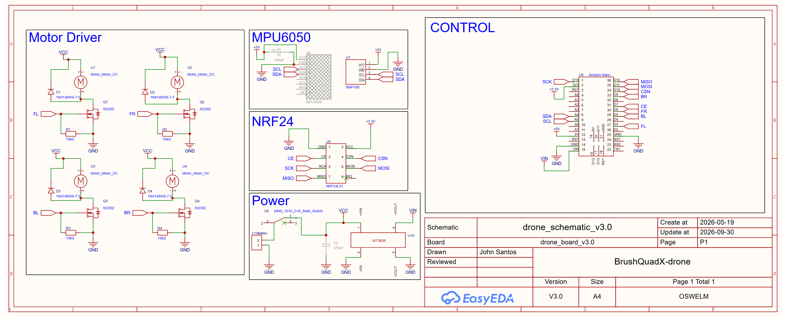
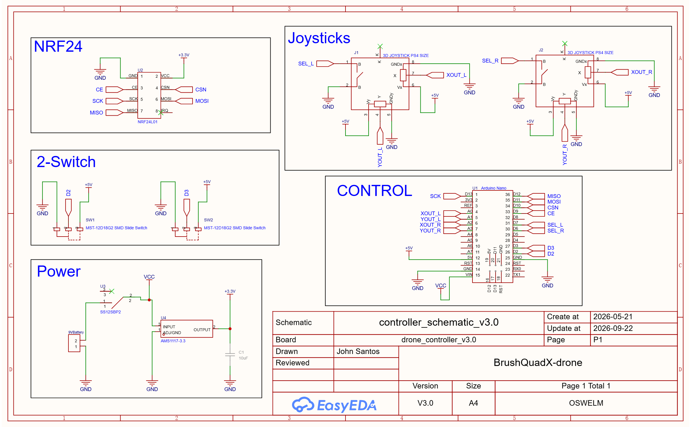
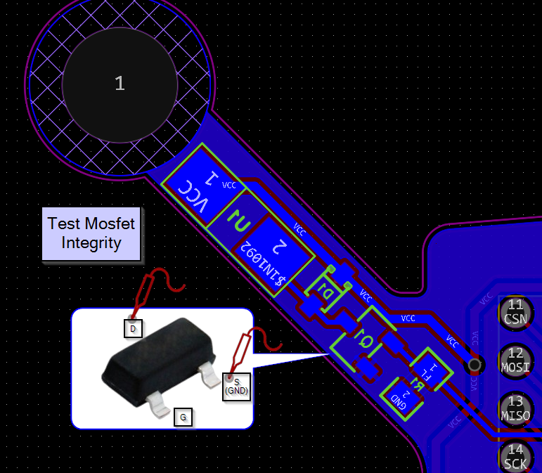
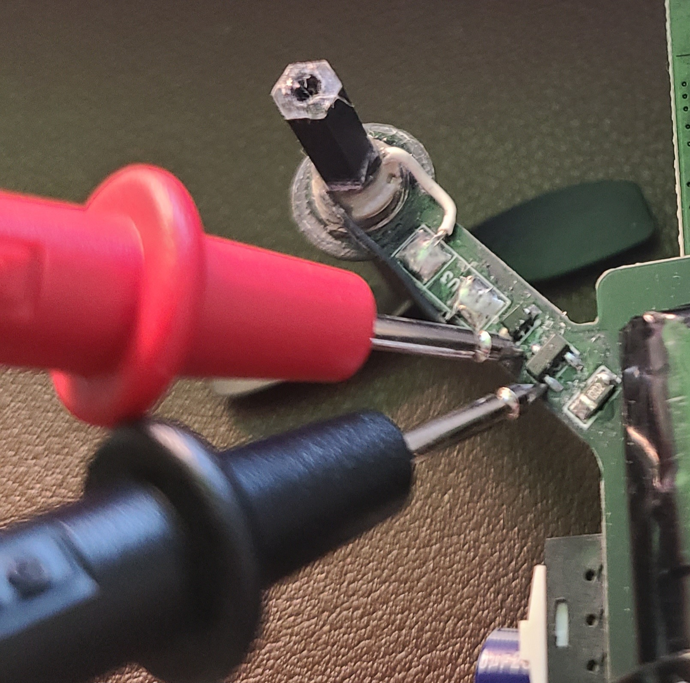
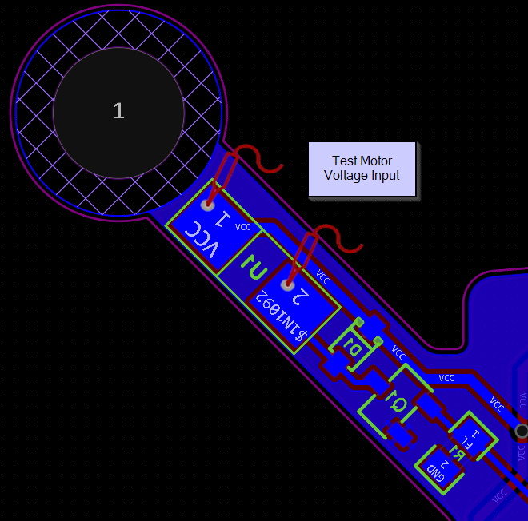

# BrushQuadX Drone Documentation

This documentation provides design, development, and implementation details of the brush quadcopter drone. 


# Schematics and Diagrams

The following schematic diagram shows the wiring components and hardware for the drone.



The following schematic diagram shows the wiring components and hardware for the drone controller. 



The tutorial for building and assembling the drone can be found under the top level `.pdf` file or the `\docs`.

# Documentation

The documentation that provides more details and tutorials on building the drone can be found under `\docs`. 

To generate the documentation using `sphinx`, follow the tutorial below with the command line. 

```shell
pip install -r requirements.txt
```

```shell
cd docs
```

### Windows (PowerShell)

```powershell
.\make.bat clean
.\make.bat html
```

### Linux/macOS

```bash
make clean
make html
```

### Windows (PowerShell)

Install MiKTeX and Strawberry Perl (`latexmk` requires Perl on Windows):

```powershell
winget install --id MiKTeX.MiKTeX -e
winget install --id StrawberryPerl.StrawberryPerl -e
```

After installation, reopen PowerShell. In MiKTeX Console, update the package database, enable installation of missing packages, and install the `latexmk` package. Confirm that `perl --version` and `latexmk --version` work in PowerShell. Then build the PDF from the `docs` directory:

```powershell
.\make.bat latexpdf
```

### Linux

Install the LaTeX dependencies and build the PDF from the `docs` directory:

```bash
sudo apt-get install latexmk
sudo apt-get install texlive-fonts-recommended
sudo apt-get install texlive-latex-extra
make latexpdf
```

# Key Learnings/Takeaways

## Design Considerations:

1. Battery 25C works for this drone
2. 5V 16MHz Arduino Pro Mini is sufficient for the drone
3. Copper EMF blocking shield helps reduce the EMF noise generated by the motor driver
4. Better to place MPU6050 away from electrical noise of the Arduino and other electrical components
5. The IMU needs to be sitting flat and secured properly to prevent wobbling
6. Capacitors helps reduce power fluctuations and noise
7. Position all 4 motors evenly and in the same manner. The start rotation should be consistent
8. Smaller surface area can cause instability? I think it is better for longer arms and larger propellers to increase the drone surface area - larger lift
9. Thicker drone arms that doesn't bend is better for stability. The overall surface area of the arms and propeller should be maximized
10. Choose your components based on the design specifications

1. Use an oscilloscope to check the PWM signals from the motor gates to see if it is causing sync issues with the motors - ensure consistent PWM frequency across all four motors

2. Test n-channel mosfet Integrity and ensure drain voltage approaches zero as gate voltage increases





3. Test Motor terminals if voltage is received



## Practical Considerations

1. Check NRF24 radio communication first before assembling the drone. Always test parts individually
2. Keep it simple and complexity should not come first. Achieve minimum functionality for initial developments
3. Better to use solder with lead, but prone to contamination (ensure proper storage)
4. Thin kapton tapes do not provide as much insulation as actual electrical tape. Though electrical tape is heavier
5. Ensure the motor power can carry the total load of the drone
6. Ensure prototype works before designing a final PCB

# Credits

Original drone software is credited to [iforce2d](https://www.youtube.com/@iforce2d).

## Drone Tutorial - Max Imagination

[](https://www.youtube.com/watch?v=Sa6EslOHsI0)

* [Elektor Labs blog post](https://www.elektormagazine.com/labs/make-a-tiny-arduino-drone-with-fpv-camera)
* [Project Files](https://drive.google.com/drive/folders/1mWTCPN2daOcmTa4wUF0j8qPXhXvxLfkK)

## Drone Tutorial - ElectroNoobs

[](https://www.youtube.com/watch?v=J0x4ChjUS00&t=719s)

# Support Forums

* https://www.instructables.com/Make-a-Tiny-Arduino-Drone-With-FPV-Camera/
* https://www.elektormagazine.com/labs/make-a-tiny-arduino-drone-with-fpv-camera
