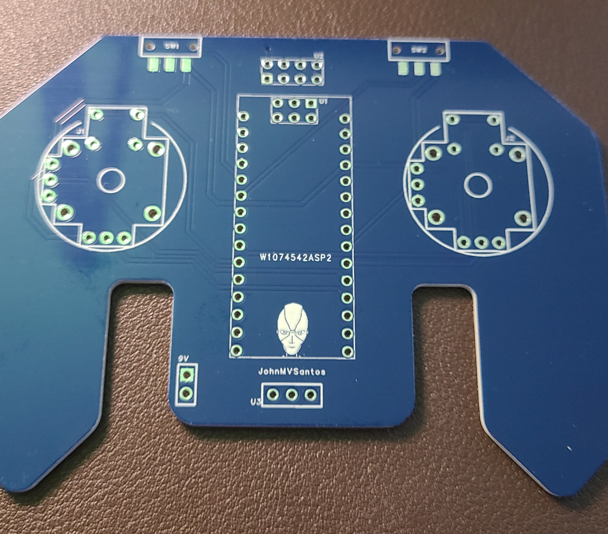
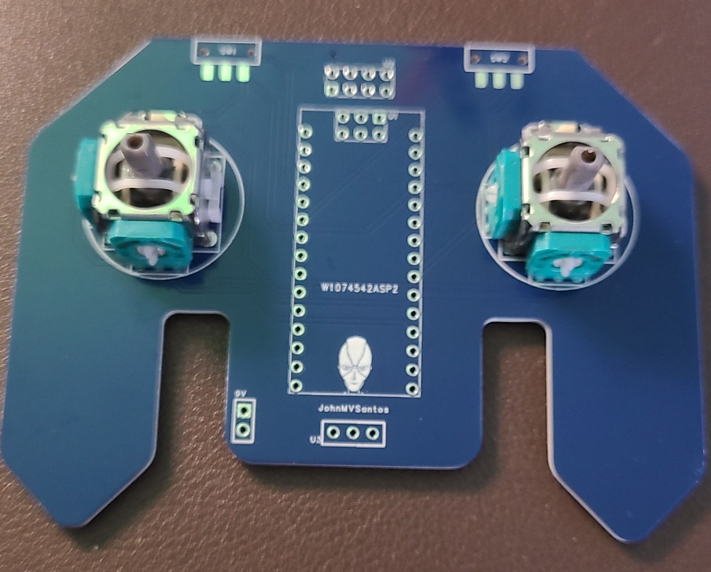
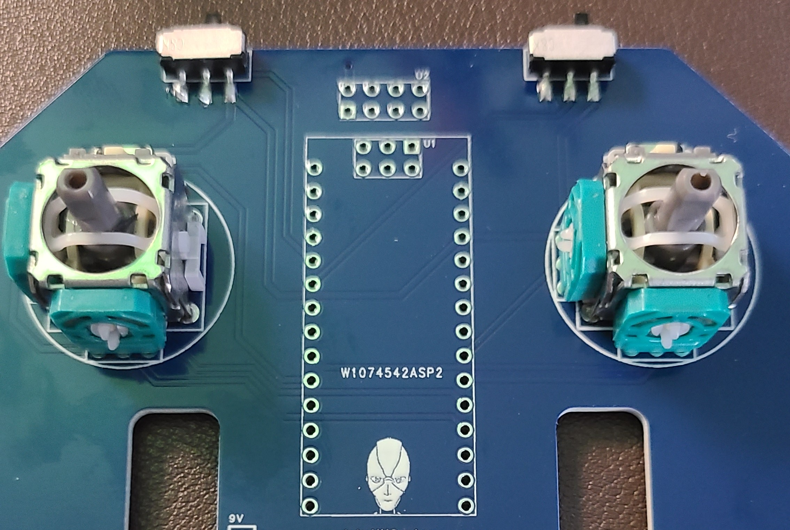
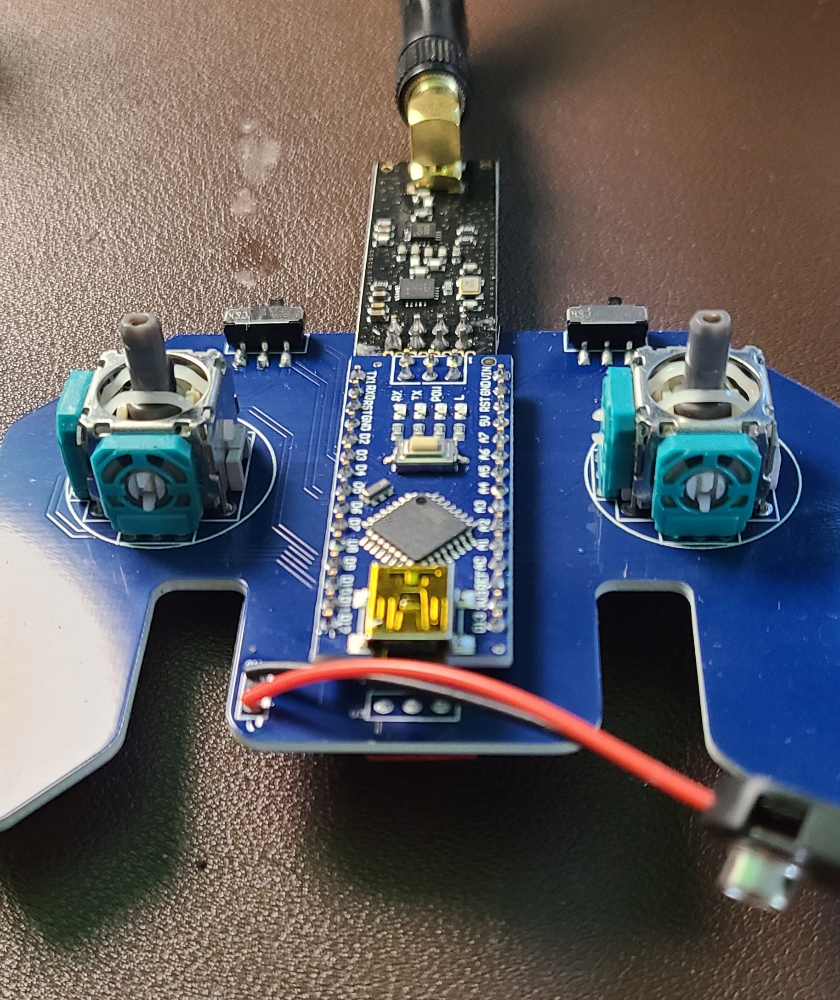
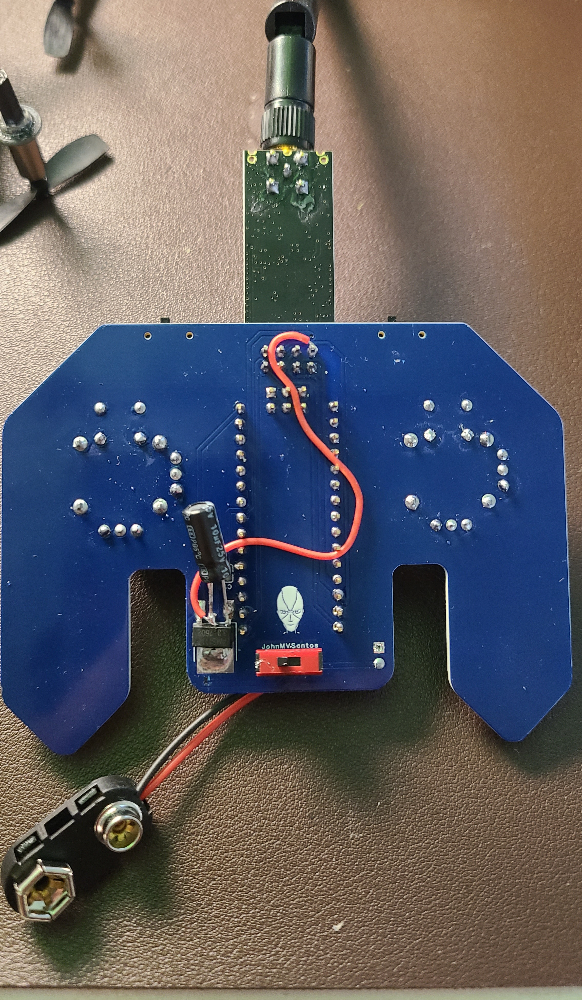
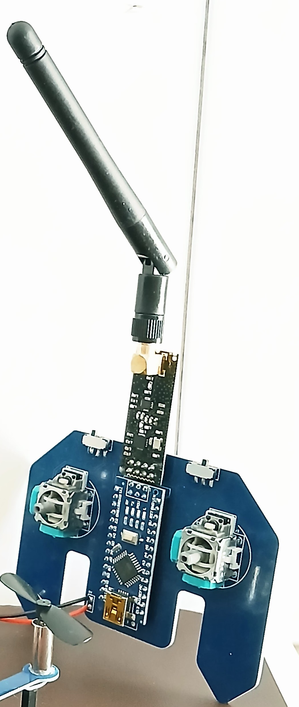

.. _controller_tutorial:

Controller Tutorial
====================

This page will show the step-by-step tutorial for building the BrushQuadX controller.

Materials
##########

1. Arduino Nano Atmega328P (x1)
2. NRF24L01+PA+LNA Transceiver Module with 8-pin Breakout Adapters (x1)
3. Joystick Module for Arduino Dual Axis Sensor (x2)
4. MST-12D18G2 SMD Slide Switch (x2)
5. SS12SBP2 Power Switch (x1)
6. AMS1117-3.3 Voltage Regulator (x1)
7. Charging Connector (x1)
8. 9V Battery (x1)
9. FPV Reciever 5.8G 150CH OTG USBC (x1)
10. 10uF capacitor (x1)

Hardware
#############

1. Take the Gerber files for the controller PCB and upload them to JLCPCB to manufacture the PCB. The Gerber file can be found in the `design_files/Gerber_Controller_PCB_v3.0_2026-10-02.zip`.

2. The controller PCB is based on the following schematic.

.. image:: assets/SCH_controller_schematic_v3.0_1-P1_2026-10-02.png
   :width: 400px
   :align: center
   :alt: Controller Circuit Schematic

3. The PCB should appear as the following when it is received.

4. Solder the joystick modules to the PCB. It is recommended to remove the spring inside the joystick to avoid returning to the center position.

5. Solder the MST-12D18G2 SMD slide switches to the PCB. These switches will be used to control the flight modes (AUX1 and AUX2) of the drone.

6. Solder the Arduino Nano and the NRF24L01+PA+LNA transceiver to the PCB as shown.

7. Solder the AMS1117-3.3 voltage regulator to the PCB with a 10uF capacitor. Then solder the SS12SBP2 power switch and the 9V battery connector to the PCB.

8. The assembled controller circuit should look like the following.

Software
##########

1. Clone `https://github.com/BrushQuadX/brushquadx-rf24-txcontroller <https://github.com/BrushQuadX/brushquadx-rf24-txcontroller>`_ repository.

2. Open Arduino IDE and open the project `BrushQuadX_RF24_TXController`. 

3. Install the following libraries and include the ZIP libraries in the Arduino IDE.

* `RF24 <https://electronoobs.com/eng_arduino_NRF24_lib.php>`_
* `TimerFreeTone_v1.5 <https://bitbucket.org/teckel12/arduino-timer-free-tone/downloads/TimerFreeTone_v1.5.zip>`_

.. image:: assets/include-libraries.png
   :width: 600px
   :align: center
   :alt: Arduino Include Libraries

4. Adjust the upload settings in Arduino under Tools to set the right board "Arduino Nano", the COM Port, and the processor to "ATmega328P (Old Bootloader)".

.. image:: assets/arduino-controller-settings.png
   :width: 600px
   :align: center
   :alt: Arduino Controller Settings
