.. _drone_tutorial:

Drone Tutorial
===============

This page will show the step-by-step tutorial for building the BrushQuadX drone. 
The tutorial will cover the hardware assembly, software installation, and 
configuration required to get the drone up and running.

Materials
##########

1. Arduino Nano Atmega328P (x1)
2. MPU6050 Gyroscope/Accelerometer (x1)
3. BMP280 Barometric Atmospheric Altitude Pressure Sensor (x1)
4. NRF24L01 (x1)
5. Micro 600TVL FPV Camera with 5.8GHz 25mW Transmitter (x1)
6. Si2302 n-channel MOSFET (x4)
7. 1N4148 Diode (x4)
8. 0805 10k Ohm Resistor (x4)
9. Brushless Motor (x4)
10. 100uF, 470uF capacitor (x1)
11. MMS1010 D-R slide switch (x1)
12. 3.7V 30C 450mAH LiPO (x1)
13. MT3608 Boost Converter (x1)
14. 46mm 0.8mm propeller (x4)
15. Molex 51005 Female Battery Connector (x1)
16. M2 2cm nylon hex standoffs (x4)

Common
-------

1. Super Glue
2. Soldering Iron and Solder
3. Mini USB to TTL Serial Converter Adaptor
4. M2 Nylon Hex Spacer Standoff Kit with Male and Female Screw Nut, etc.
5. 30AWG wires

Hardware
#############

1. Take the Gerber files for the drone PCB and upload them to JLCPCB to manufacture the PCB. The Gerber file can be found in the `design_files/Gerber_Drone_PCB_v3.0_2026-10-02.zip`. 

2. The drone PCB is based on the following schematic.

.. image:: assets/SCH_drone_schematic_v3.0_1-P1_2026-10-02.png
   :width: 600px
   :align: center
   :alt: Drone Circuit Schematic

3. The PCB should appear as the following when it is received.

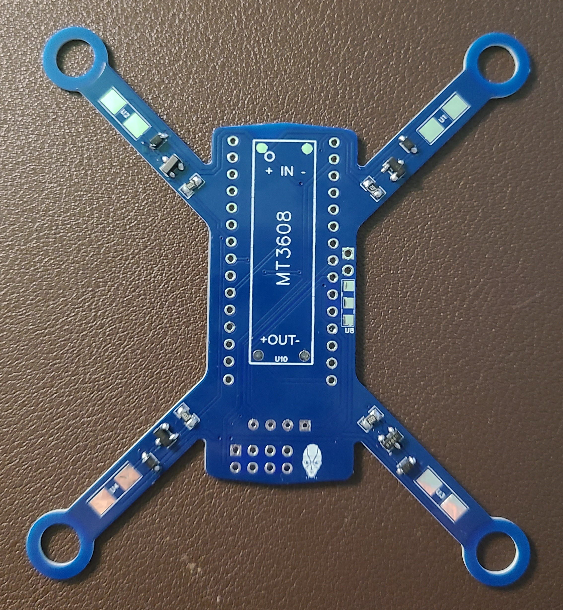

4. Assemble and solder the motor driver of the drone along the arms with 10KOhm resistor 0805, 1N4148 surface mount diodes, and Si2302DS n-channel MOSFETS.

.. list-table::
   :widths: 50 50
   :header-rows: 0

   * - .. image:: assets/drone_motor_driver_components.jpg
         :width: 300px
         :alt: Drone Motor Driver Connections
     - .. image:: assets/drone_motor_driver_connection.jpg
         :width: 300px
         :alt: Drone Motor Driver Connections

5. Solder the MMS1010 D-R slide switch and the Molex 51005 Female Battery Connector to the PCB as shown. Then solder the Arduino Nano to the PCB.

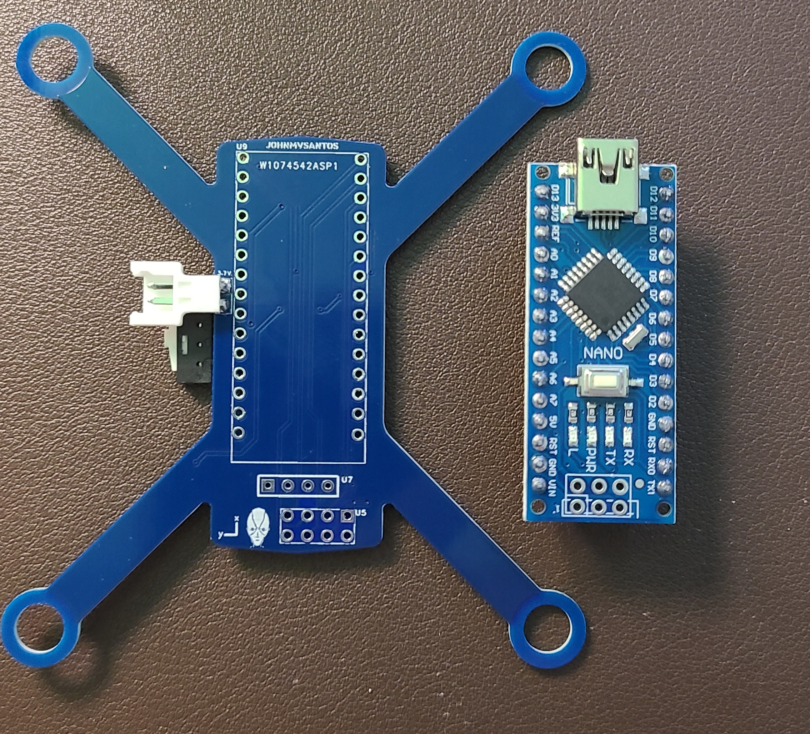

6. Create an extended 4 pin male to male adaptor as shown in the following image to connect the MPU6050 and BMP280 to the PCB.

.. list-table::
   :widths: 50 50
   :header-rows: 0

   * - .. image:: assets/pin_extended.jpg
         :width: 300px
         :alt: Extended Pin Connections
     - .. image:: assets/pin_extended_soldered.jpg
         :width: 300px
         :alt: Extended Pin Connections Soldered

7. Solder the extended pin connection to the PCB.

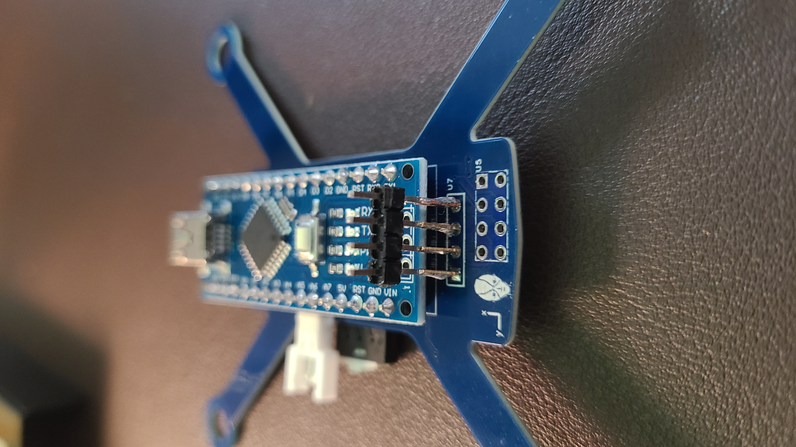

8. Solder the MPU6050 to the extended pin connection. Also connect a 100uF capacitor to the VCC and GND of the MPU6050 to reduce noise.

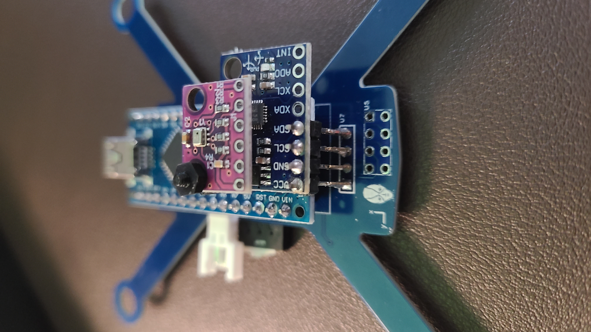

9. Solder the BMP280 to the MPU6050.

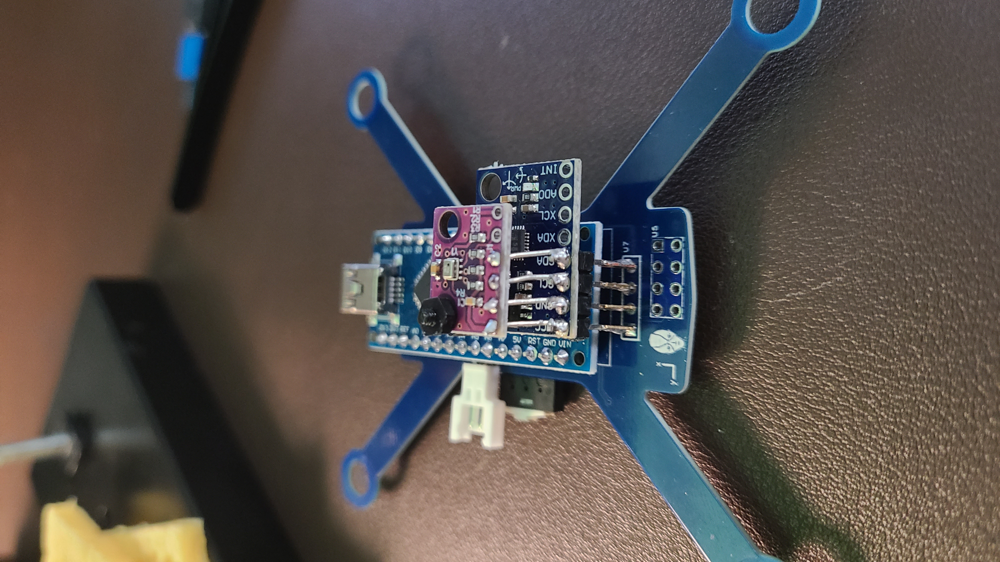

10. Solder the NRF24L01 module to the PCB.

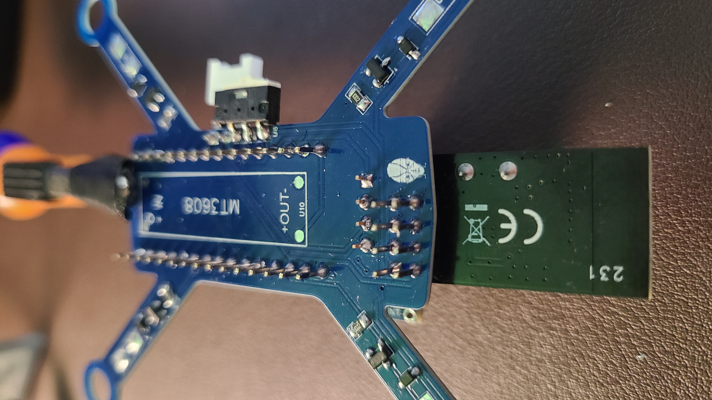

11. Solder the MT3608 DC-DC Boost Converter to the PCB. Also connect a 470uF capacitor to the VCC and GND of the MT3608 to reduce noise.

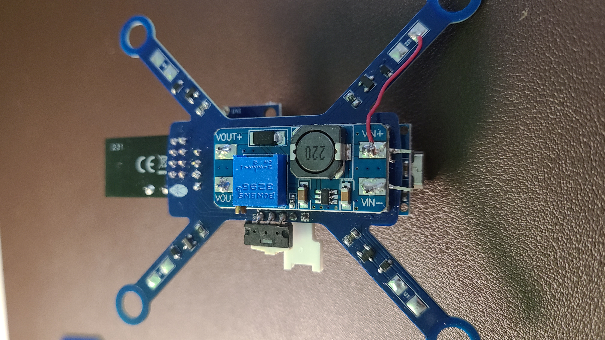

12. Superglue the brush motors to the through holes of the PCB based on the following orientation:

* Top Left: Motor 1 (CW Red/Blue)
* Top Right: Motor 2 (CCW White/Black)
* Bottom Left: Motor 3 (CCW White/Black)
* Bottom Right: Motor 4 (CW Red/Blue)

The wires are soldered to the PCB by having the red or white power lines connected to the positive terminal which is closest to the motor.

Then attached the battery to the drone using zip ties.

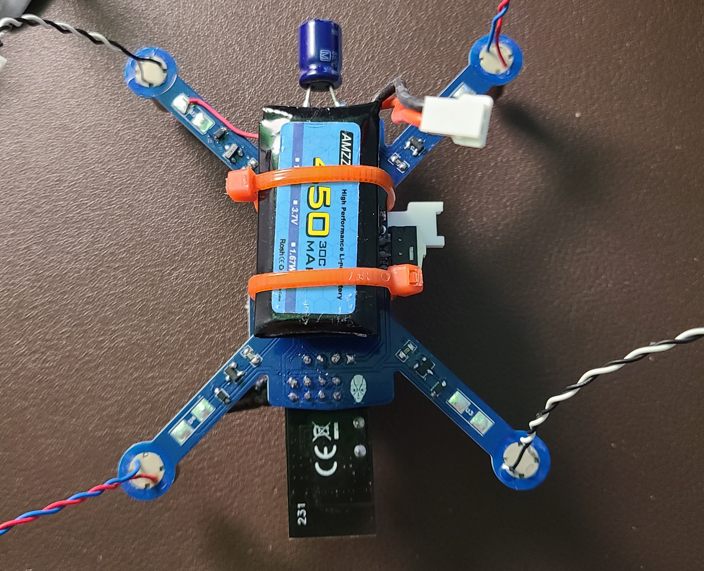

13. Attach M2 2cm nylon hex standoffs to the bottom of the PCB as lefts for the drone as shown.

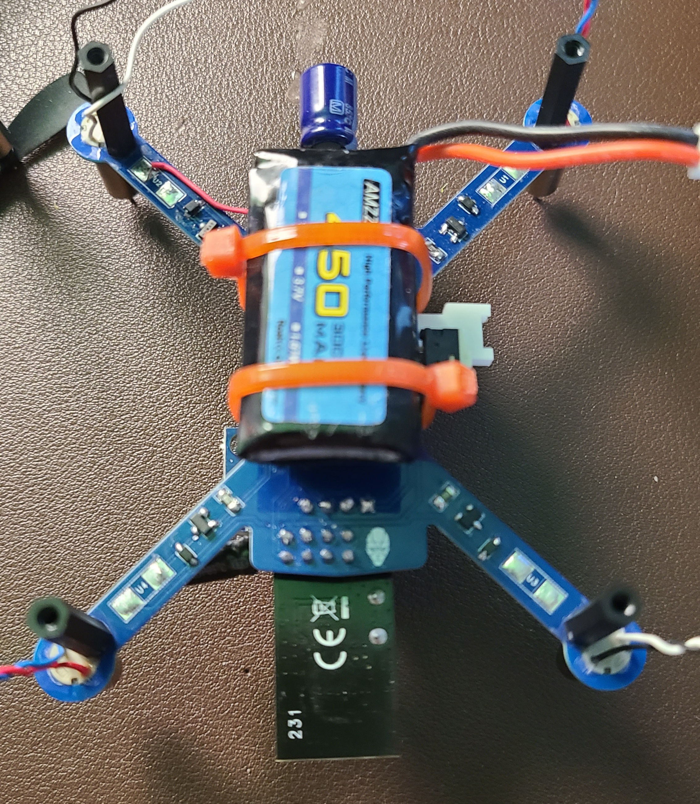

14. The FPV camera can be powered by connecting the red and black wire to the VCC and GND input pins of the MT3608 DC-DC Boost Converter. 
The camera can be attached on top of Arduino Nano USB port using super glue. In the following image, a DIY platform was used to hold the camera using zip ties.

15. The final assembled drone should look like the following.

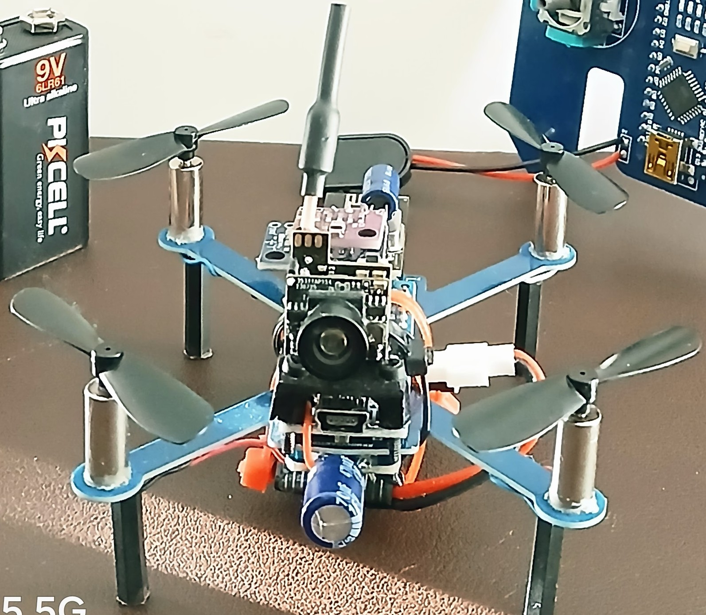

Software
##########

1. Clone the `https://github.com/BrushQuadX/brushquadx-rf24-rxdrone <https://github.com/BrushQuadX/brushquadx-rf24-rxdrone>`_ repository.

2. Open Arduino IDE and open the project `BrushQuadX_RF24_RXDrone`.

3. Install the following libraries and include the ZIP libraries in the Arduino IDE.

* `RF24 <https://electronoobs.com/eng_arduino_NRF24_lib.php>`_
* `TimerFreeTone_v1.5 <https://bitbucket.org/teckel12/arduino-timer-free-tone/downloads/TimerFreeTone_v1.5.zip>`_

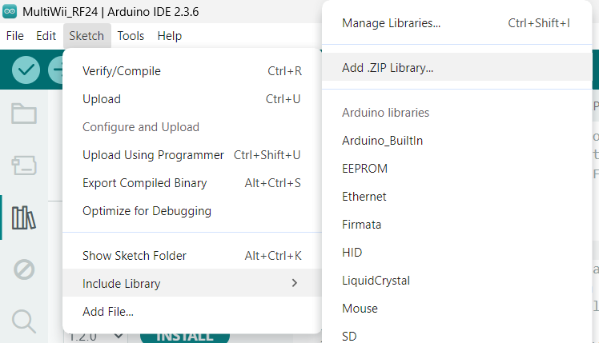

4. Adjust the upload settings in Arduino under Tools to set the right board "Arduino Nano", the COM Port, and the processor to "ATmega328P (Old Bootloader)".

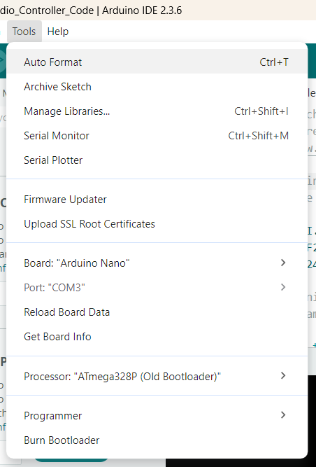
