.. _prototypes:

Reflection
===========

The inspiration behind this project stems from `Max Imaginations' Mini FPV Drone Tutorial <https://www.youtube.com/watch?v=Sa6EslOHsI0>`_.
Watching his video sparked my interest in recreating the project with my own design and modifications.
Furthermore, I wanted to apply the technical concepts I learned throughout my studies in electrical engineering to enhance my understanding of the subjects.

It was not easy to commit to the project in the beginning because I knew that I will be spending lots of time and resources 
towards re-design and re-iteration and acquiring electrical and mechanical concepts. Furthermore, I understood that there will be
new concepts that I'll learn outside of my studies in University such as designing a custom PCB board. On top of this, my time is even
more limited because I'm currently committed to working full-time at a software company. So most of my time working on this
project was spent during the weekends and late nights after work.

However, I was determined to see this project through completion; to have a better understanding of concepts
related in electrical engineering and to create something new despite the challenges and my lack of personal experience
in building drones.

Protoype 1 - June 8, 2025
--------------------------

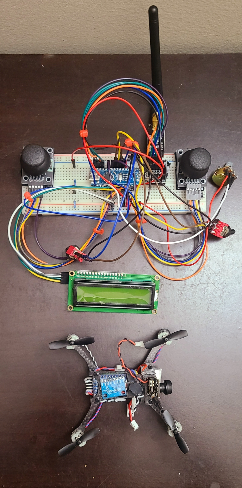

|

The start of the project was slow as I had to first list all of the electrical and mechanical components I needed to build the drone and the controller.
I researched the cost, size, and weight of each component because I wanted to design a custom frame for the drone. Although most of the components I used remains the
same as Max Imaginations' drone, I wanted to modify the frame to appear more modern and modular using carbon fiber as the main material. So I sketched a design to my 
liking and drew a blueprint cutout of the various parts, and using a dremel, I cut out the pieces on a 0.5mm carbon fiber sheet. The pieces were
assembled together using M2 screws and nuts to hold the pieces in place.

Next I redrew the circuit schematic using EasyEDA and purchased the various electrical components from Amazon and Digikey or Mouser. Once all
the components arrived, I started soldering the connections between the components using 24AWG wires. I had some challenges initially when trying to solder
these components because the soldering iron oxidized quickly which is probably due to poor techniques because of my lack of experience or the solder
material I used was poor. So I ended up switching the solder tips quite frequently. In the future, I had speculated that failures of certain components stems from the poor 
solder job which could either be from a cold solder (no effective contact) or smaller surface mounts had a short circuit.

I reached the stage where the drone and the controller was fully assembled and programmed using Arduino. However, I began seeing several
issues when arming the drone using MultiWii; the drone's IMU movements and the controller's joystick movements were not captured and simulated in MultiWii which 
prevented the drone from being armed. Furthermore, MultiWii was only able to capture the IMU's movements when grounding pin D12 on the Arduino Pro Mini MCU which
was quite arbitrary for me at that moment. Given the numerous unexpected behaviours and issues, I decided to take a step back and reflect on my design and assess
the changes and corrections I needed to make to resolve the issues I was facing. 

**The main issues are listed below:**

1. Too heavy
    - Motor fasteners that were improvised using drywall anchors were too heavy (motors will be glued directly in the next prototype)
    - The wires were too thick using 24AWG
    - The perforated board was too large with lots of unused space
    - The soldered JST connectors (NRF24L01, perforated board, buzzer) are too heavy (these will be removed and wires will be soldered directly in the next prototype)
    - 1N5819 diodes are too heavy (using 1N4148 surface mount diodes in the next prototype)
    - Using velcro to mount the camera is too heavy (use super glue instead)

2. Small Propellers/Less Thrust
    - Using 2 blade (faster) 37mm propellers (use 4 blade propellers for more thrust)

3. Conductive Carbon Fiber Frame
    - Possible short circuits when mounted on the carbon fiber frame (use kapton tape for better insulation with the electrical components)

4. Poor Solder Connections
    - Damaged solder tips (oxidized) resulted in poor solder connections with possible decrease in conductivity and connectivity between components and possible short circuits
    - Replace solder tips and properly resolder the connections in the next prototype

5. Need Soldered Controller with Enclosure
    - The controller uses a breadboard with weak connections and unmanaged wiring. Requires a proper enclosure with soldered connections for better connections

**Additional materials and replacement needed for the next prototype:**

1. Arduino Pro Mini Atmega 328P 5V/16MHz (un-soldered)
2. MPU6050 from DFRobot (un-soldered)
3. Motor Encoder Circuit
    - Surface mount 1N4148 diodes
    - Solder tips + high quality thin solder 
4. Larger 4 blade propellers
5. Kapton tape for insulation
6. Copper Sheet for proper grounding

Protoype 1.1 - June 22, 2025
-----------------------------

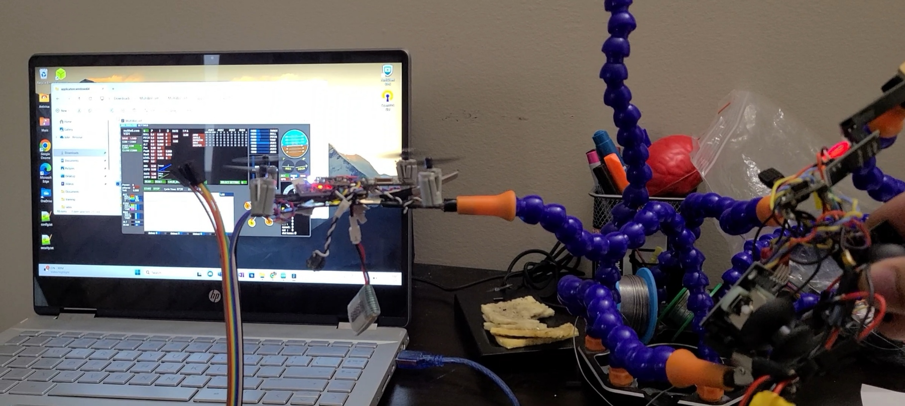

|

This prototype has a more compact design with shorter connections and lighter wires. Furthermore, 
the controller now has a proper enclosure created from a toy RC enclosure that has been
modified to fit the components of this drone. However, despite the modifications, the drone was
still not successful in lifting off.

This prototype started by assembling and soldering the connections between the eletrical components
using 28 AWG silicon copper wires. The controller was built by modifying an old RC toy enclosure using a dremel
tool so that the new components fit properly inside the enclosure.

Once the drone and the controller were assembled, both were then programmed using Arduino. In this 
prototype, MultiWii was able to capture the drone's IMU measurements. However, MultiWii still could not
capture the controller's joystick movements. It turns out the radio transmitter I used for my controller
was faulty and I learned that it is always best to test individual components first prior to integration into the system.
A simple test can be setup to program two radio modules as a transmitter and a reciever to test whether or not
both modules can properly communicate with each other. Once I received a new set of functional radio modules, the drone
and MultiWii can finally receive the radio signals from the transmitter.

Lastly, I observed the drone's behaviour to be erratic; I was not fully confident that the drone's enclosure is properly insulated which
may have affected the drone's components. So I tested the drone without the enclosure and I found that the motors seem to
respond properly when I throttle up and down using the controller. Yet the issue of poor insulation on the carbon fiber enclosure
remained and I had a speculation that the drone short circuited from the enclosure after reattaching causing permanent damage
to the electrical components. I learned that I should have tested the insulation of the frame and should not have relied
on the assumption that the kapton tape I applied had fully insulated the enclosure.

Yet again, this prototype has failed so I have taken another step back to assess the failures and make
further revisions to resolve the issues.

**The main issues are listed below:**

1. Kapton Tape did not provide proper insulation
    - After adding one layer of kapton tape, it seemed that the electrical components, mainly the IMU shorted and was damaged. This resulted in the accelerometer unable to properly register the movements in MultiWii. The next prototype will include a proper enclosure for the electrical components of the drone. Although the main frame will still be carbon fiber, a separate box enclsoure will be used to cover the electrical components properly using light materials
    - Investigated the use of hot glue for proper insulation; however, initial research suggests this may cause damages to the electrical components

2. Controller is Too Complex
    - "Simplicity is the ultimate sophistication." - Leonardo da Vinci 
    - Unnessary components in the controller atleast for the MVP such as the 16x2 LCD to track voltage and the potentiometer should be removed. The controller should be simplified to only include the basic components needed for communicating with the drone and this includes the Arduino Nano controller, the radio module + PA + LNA components, the two joysticks, the two SPDT switches, and the SPST switch with the 3.7V batteries

3. Controller Battery has too much current
    - Prolonged use of the controller lead to overheating of the components and controller failure. Theory is that the battery packs too much current which the components could not handle resulting in breakdown. The two batteries are connected in series are 3.7V 1000mAH. Looking into the use of 3.7V and 600mAH batteries instead

4. Remove the Grounded Copper Sheet
    - This may not be needed as I have not encountered any issues with the drone resetting. This solution was suggested online, but I should not implement solutions to problems that does not exist in my design

**Additional materials and replacement needed for the next prototype:**

1. Arduino Pro Mini Atmega 328P 5V/16MHz (un-soldered)
2. Arduino Nano 
3. Radio Modules NRF24L01 + PA + LNA
4. 3.7V 600mAH batteries (2x)

Prototype 1.2 - August 18, 2025
--------------------------------

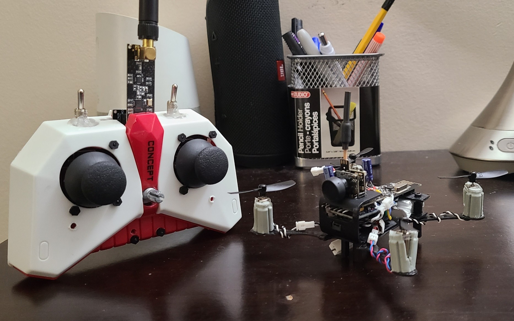

|

The behaviour of this prototype was still erratic; the drone kept resetting and recalibrating when I throttle down. The motor responses were rare and seldom spins. 
When the motor does respond, it respond in bursts and then the drone resets. Looking 
at the MultiWii outputs, the AUX1 and AUX2 switches and the joystick movements for 
roll, pitch, yaw, throttle levels were correctly simulated in the software. So I think 
the issue stems from the drone hardware rather than the controller.

The primary issue in this prototype is that the motors do not respond despite the 
joystick movements being translated correctly in MulitWii. The drone keeps resetting and 
attempts to calibrate everytime the controller attempts to throttle up and down. 

**I suspect the possible issues with the drone are listed below:**

1. The battery discharge rate is too low (25C) and that a proper drone battery with a higher discharge rate (30C or higher) is needed
    - *Recommended to use "Turnigy Nano-Tech" batteries or similar for their high performance*
2. The power for the radio is not consistent and requires a 10uF filtering capacitor at the NRF24 power inputs
3. The power for the Arduino Pro Mini is not consistent and requires a 100uF filtering capacitor
    - Confirm Arduino Pro Mini 3.3V 8MHz, or 5V 16MHz is required (*Arduino Pro Mini 5V 16MHz is compatible with MultiWii*)
4. The power lines has a large AWG (small thickness) where the current cannot be supplied properly
    - Recommended to use solder with lead and keep solder enclosed after use to avoid contamination/oxidation
    - For the motor driver, ensure the components are rated for this circuit
    - The following components are being used but requires confirmation; 0603 10K SMD resistor 103, SI2300DS-T1-GE3CT-ND N-Channel Mosfet 30V 3.6A, 1N4148 diode surface mount
5. Motor PWM signals could be too weak to drive the motors
    - Requires oscilloscope to confirm gate frequency
    - This factor can be set in the drone firmware, `float adjustmentFactor` on line 1069 of output.cpp
6. Potential EMF noise or leaks is affecting the IMU readings? 
7. The Arduino Pro Mini purchased from "Hutomwua" is faulty. The previous prototypes purchased from "Robojax" was working

Looking for a battery replacement greater than 25C was quite a challenge as most of the batteries I found were 25C or lower. 
It was recommended to use "Turnigy Nano-Tech" batteries for their high performance, but those were always
unavailable and kept being out of stock due to their high demand. Although I did manage to find a 30C LiPO battery from AMZZN, but it still did not
improve the drone's behaviour.

**Additional materials and replacement needed for the next prototype:**

1. Arduino Pro Mini Atmega 328P 5V/16MHz (un-soldered) from Robojax specifically

I then tried adding filtering capacitors at the power inputs of the NRF24L01 and the Arduino Pro Mini, but
this also did not improve the drone's behaviour. I also ensured the power and radio connections were solid
and properly connected. Next I created a new motor driver with new components as I had speculated the previous
build had short circuited, but this new replacement still did not improve the drone's behaviour.

I then suspected the issues had to do with the drone's software and the PWM signals driving the motors
had a low frequency. Unfortunately, I did not have an oscilloscope to verify the PWM signals at the gates, but 
I found the factor in the drone's software that tunes the PWM outputs. By following the tutorial in Max Imaginations'
video, the variable that adjusts the PWM signals is controlled by `float adjustmentFactor = 0.255` in line 1069 of output.cpp. 
The modifications made to this variable did not improve the drone's erratic behaviour, but it 
did tune the buzzer's noises lower. As a future work, it seems best to purchase an oscilloscope 
confirm the PWM frequency suspicions.

My final attempts in resolving the drone's erratic behaviour was retracing my steps for
properly arming the drone using MultiWii. First the AUX1 and AUX2 switches should be set high when
arming the drone and the beeper. Once set, the drone accelerometer should be recalibrated an then press
read and write to save the changes. To arm and recalibrate the drone, the AUX1 switch should be set low 
and the throttle and pitch joysticks should be moved to zero until the calibration signals from the
beeper are in effect. Once in effect, wait atleast 3 seconds to apply the recalibration. By following
these steps, the drone still did not manage to respond from my controller's commands.

My suspicion towards the source of the issue is the drone's hardware. The Arduino Pro Mini I used might have
been faulty since the previous prototype (v1.1) did respond to my controller's commands. I will
find another microcontroller ideally from the same manufacturer as v1.1 and then I will confirm the
specifications of the motor driver components are properly rated for this design and meets the power
requirements.

Prototype 1.3 - August 31, 2025
--------------------------------

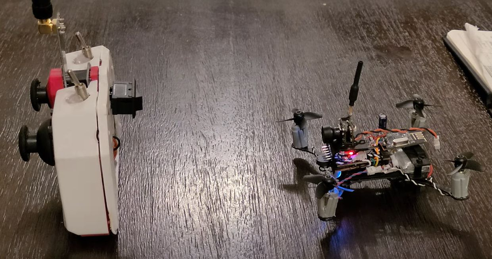

|

The suspicion that the Arduino Pro Mini microcontroller being faulty was true. 
The Arduino Pro Mini purchased from "Hutomwua" had a board frequency of 10MHz.
The requirements for correctly interfacing with MultiWii requires a 5V 16MHz microcontroller.
I re-purchased a 5V 16MHz Arduino Pro Mini from "Robojax" which resolved the erratic drone behaviour
which allowed the drone to respond to the controller's joystick movements.

However, the design is still not perfect as more issues surfaced. Although the motors
responds to the joystick movements, the drone's attempt to lift off was quite unstable.

**The possible issues are listed below**

1. The drone is not calibrated properly
    - The drone needs to sit on a flat surface for a proper calibration
    - The accelerometer and the gyroscope needs proper calibration
    - Adjust settings in MultiWii configuration with max smoothness
2. Motor/propeller direction is wrong
    - This can be verified by feeling if the air is being pushed upwards
    - Record slow motion video to see the direction of the motors
3. The motor RPMs are not the same and unsynchronized
4. The forward direction of the MPU6050 is in the opposite direction
    - Rewire orientation of the motors to have face the MPU6050 in its forward direction
5. The drone is still too heavy and certain weights of the components are not balanced causing the center of gravity to be offset
    - Remove heavy motor mounts and just rely on superglue to attach the motors
6. The arms of the drone are limble which causes wobbling during flight
    - Reinforce the arms with a stronger material that doesn't bend such as popsicle sticks

Prototype 1.4 - November 30, 2025
----------------------------------

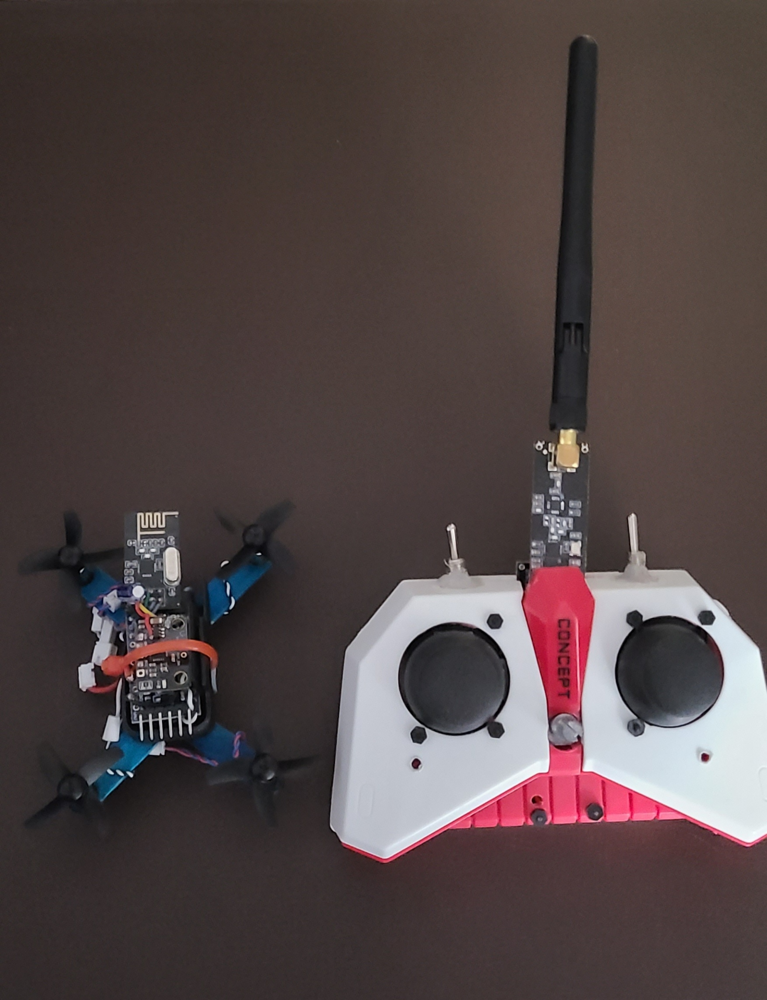

|

In this prototype, the drone accelerometer was re-calibrated and an EMF copper blocking 
shield was installed to prevent EMF interference generated from the motor driver to the
Arduino Pro Mini microcontroller. Furthermore, the motor direction was verified:

* Top left -> clockwise
* Top right -> counter clockwise
* Bottom left -> counter clockwise
* Bottom right -> clockwise

The bottom right propeller from the previous prototype was wrong which pushed the air upwards.
For stability, the arms were replaced with popsicle sticks to prevent any oscillations during flight
and the motors were super glued directly to the arms.

Despite the changes, the drone still could not achieve a proper liftoff. PID tuning has also been explored 
and adjusted, but I could still not find the right values for a stable flight.

**The possible remaining issues are listed below**

1. IMU is not secured properly and wobbles during flight
2. The frame is still too heavy
3. Smaller propellers + less surface area results in unstable flights
4. Battery is mounted at the bottom making it hard to connect - perhaps a switch is more convenient
5. Wrong drone output behaviour or motor mapping from the joystick movements - requires a software correction
6. Needs further PID tuning for the roll, pitch, and yaw values

The current configurations with the expected behaviour and the actual behaviour are noted below.

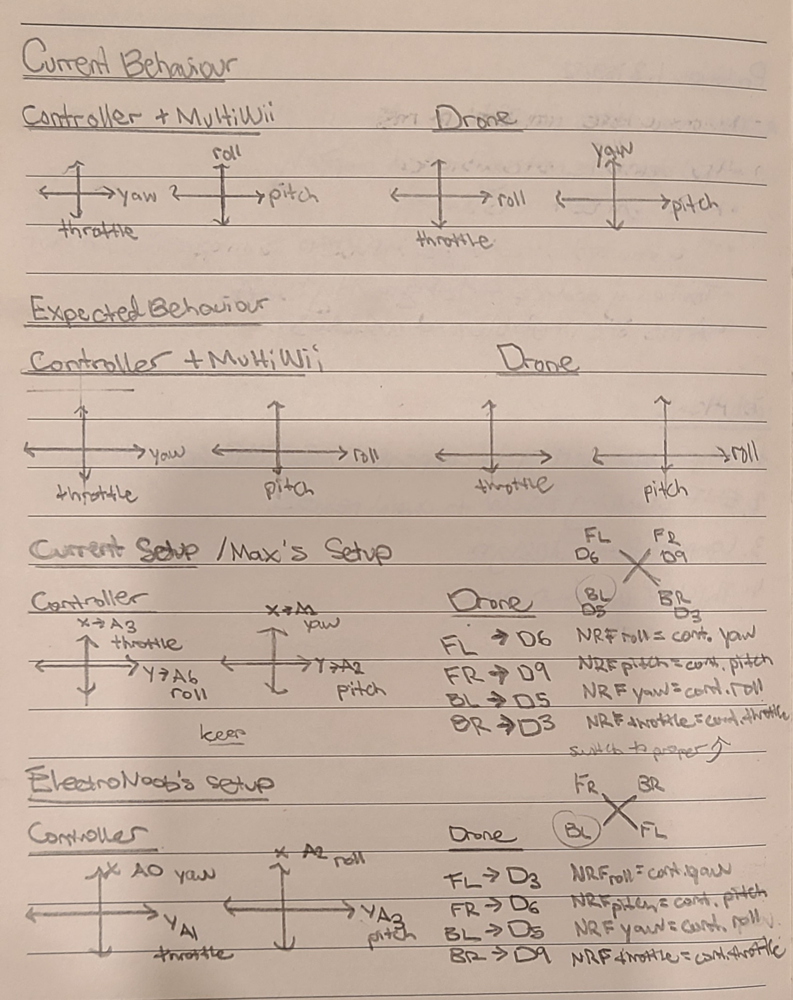

**Design changes for the next prototype**

New frame requires light and thinner materials, but maintain thicker inflexible arms with more propeller surface area.
The battery should be mounted on the top for easier connection and allow center of gravity re-adjustments. Superglue connections
instead of screws to reduce weight.

1. Software correction to the motor mapping behaviour
2. Configure joystick values for correct controller calibration
3. Lighter frame, longer arms, secure mounts
4. Proper PID tuning for the drone's roll, pitch, and yaw

Prototype 1.5 - January 31, 2026
---------------------------------

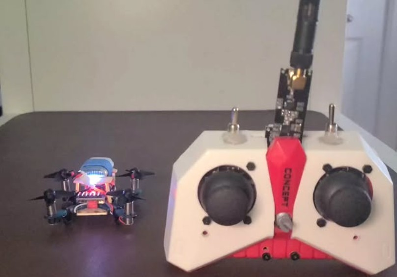

|

This prototype is based on re-designing the frame to use popsicle sticks and superglue to reduce the
overall weight of the drone. Despite the lighter frame, the drone is still unable to properly
lift off. I suspect the issue could stem from the following reasons:

**The possible issues are listed below**

1. Components are placed that causes weight imbalance and an offset center of gravity - seems that the left side of the drone pulls up more
2. The motors spin at different RPMs causing unsynchronized motors - the PWM signals also needs to be verified
3. The motors still spins in the wrong direction
4. The drone also resets sometimes - a resistor at the reset pin of the microcontroller to avoid further resetting or it is missing a proper EMF blocking shield using a copper sheet with clear tape attached to a grounded wire
5. The drone might need PID tuning and joystick value adjustments to follow exactly Max Imaginations' settings
6. Motor driver components are too close to the controller (large EMF effects)
7. All power is drawn from the same source connected to the VCC pin of the Arduino Pro Mini preventing the microcontroller to receive sufficient power (perhaps power should be connected directly to the raw pin instead of VCC)
8. Wire thickness used is 28AWG (from 1.25mm connector sockets) - should be 30AWG+
9. The incorrect translation from the controller joystick movements to the drone motor behaviour is causing instability
10. IMU is not sitting flat and it is still unstable - potentially the IMU is not positioned correctly
11. Drone motors are not positioned evenly
12. The frame is still too heavy
13. Small surface area drone propellers is causing instability
14. Potential software issue settings are incorrect - try disabling `FORCE_GYRO`

**Here is a list of unknown variables I encountered**

1. On MultiWii, the IMU yaw value continues to rotate even though the drone is placed flat on the table

**Design changes for the next prototype**

The next prototype will explore designing a custom made PCB to reduce complex external
wiring; to have compact the design and reduce overall weight of the frame. Furthermore,
I will explore different motor driver components to withstand potential current or power 
rating issues. 

1. Placement of motor driver components on the arms to disperse combined EMF effects and reduce interference with the microcontroller
2. Power should be directly towards raw pin, VCC, or both?
3. Convert the drone to a PCB to have solid connections between components and reduce the weight from the wires
4. PWM drone pins should be consistent with Electronoobs: FR (D6), BR (D9), BL (D5), FL (D3)
5. Max Imaginations' right joystick seems rotated in his diagram - should also compensate my joystick to match his design
6. Calibrate controller settings to match the intended joystick min, middle, max values

Prototype 2.0 - March 28, 2026
--------------------------------

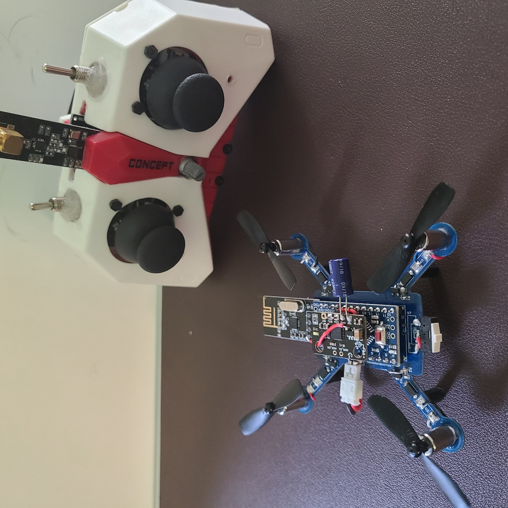

|

In this prototype, a custom PCB for the drone and the controller was designed using EasyEDA
and manufactured using JLCPCB. The motivation behind this decision was to produce clean and 
compact connections between components and ultimately reducing the overall weight of the drone.
The PCB is designed to be its own frame and the components are soldered directly onto the board. 
I have chosen different motor driver components rated for this circuit. 

- 10KOhm resistor 0805 (0.125W)   `CRG0805F10K <https://www.digikey.ca/en/products/detail/te-connectivity-passive-product/CRG0805F10K/2380831>`_
    * Ensures VGS = 0
- Diode: `SS54FSH <https://www.digikey.ca/en/products/detail/taiwan-semiconductor-corporation/SS54FSH/18718584>`_ (5A, 40V)
    * Maximum rated current must be greater than 2 * stall current (assuming 2-6A)
- N- Channel Mosfet: `AO3400A <https://www.digikey.ca/en/products/detail/alpha-omega-semiconductor-inc/AO3400A/1855772>`_ or `AO3416 <https://www.digikey.ca/en/products/detail/alpha-omega-semiconductor-inc/AO3416/1855783>`_
    * VDS ~>20-30V is better (rated for high voltage spikes)
    * RDS ~<10mOhm is better (low power loss)
    * Gate threshold ~2.5-3.3V (turns on based on battery capacity)
    * Continuous & Pulsed Current Rating should exceed peak and continuous current draw in drone (5.5A = 25C * 0.22Ah)

The previous components had the following limitations:

- 10KOhm resistor 0603 (0.1W, 2.A max current)
    - Low power and current rating
- 1N5819/1N4148 - Used: 1N4148WS-13-F  (Consider using 1N5819 for low voltage drops)
    - 1N5819: Low voltage drop (~0.3-0.4V)
    - 1N4148: Fast switching, but higher voltage drop (~0.7V)
    - Current rating must be greater than 2 * stall current (2-6A assuming)
- S12300 n-mosfet - Used: SI2300DS-T1-GE3CT-ND

However, despite the design changes, the drone still could not lift off and behaves even poorly. 
When testing the assembled PCB, it seems most of the power is being drawn towards the back right motor
since it is the only motor that spins. When I disconnect this motor, the other three motors spin, and the resetting
issue from the previous prototype still persists. It seems that separating the motor driver across the arms
of the drone does not mitigate the EMF effects towards the microcontroller since the drone continues to reset.
I even tried adding 100uF capacitors between the power and the ground pins of the MPU6050, but this did
not resolve the resetting issue.

**The design issues discovered from this prototype are listed below**

1. Bottom right motor keeps spinning uncontrollably - should separate power connections between the motors and the microcontroller
2. Battery with larger C rating did not fix the reset issue
3. 100uF capacitor at the MPU6050 power pins did not fix the reset issue
4. Thicker power lines and reinforcing connections with external wires did not resolve the issue
5. Speculating that MultiWii being an old software had problems arming the drone properly and my environment installations and Java versions could not support a stable MultiWii version

**The possible reasons for these issues are listed below**

1. Power management - the battery is not strong enough to drive both the Arduino Pro Mini and the motors
2. Power lines set to 0.254mm (default width) are too thin to deliver power properly and the power lines should be similar in length
3. The motor driver and the microcontroller are placed on the top layer preventing any copper layer separation between the two components to reduce drone resetting*
4. 90 degree line traces are evident in some of the connections which can cause impedence issues

    .. image:: assets/sample_90_degree_traces.png
        :width: 300px
        :align: center
        :alt: 90 Degree Line Traces

5. Props are placed incorrectly - still felt air pushed upwards
6. Motor placement is not consistent - motors needs to be at the same start rotation
7. Need to use the exact same components as Max Imagination's design such as 1N4148
8. Need to use a better power switch (SPST) - might not be driving enough current to the motors
9. Filtering capacitors might be needed at the motors to reduce noise
10. PWM signals at the motor gates needs to be sufficient and consistent across the motors
11. Manual testing of the controller linear increase in throttle to check if all motors respond accordingly
12. Individual motors need to be tested at full power with scale load

Prototype 2.1 - April 26, 2026
-------------------------------

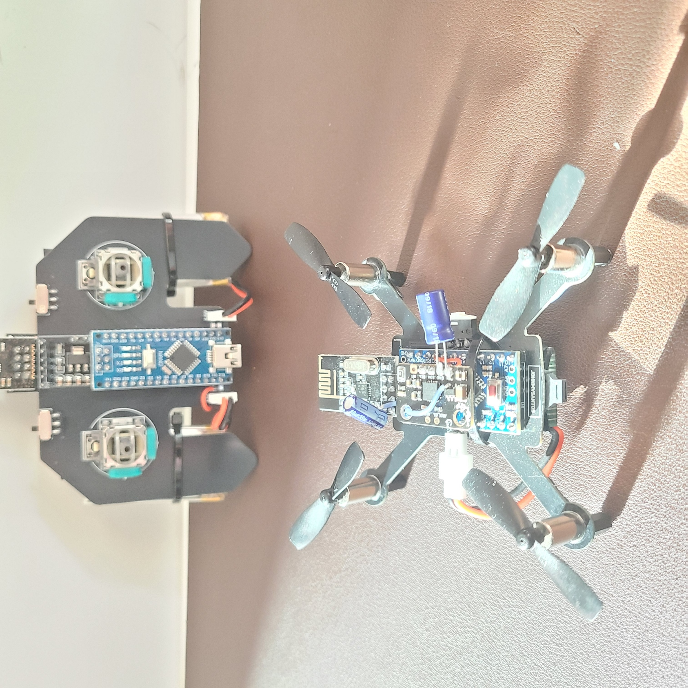

|

This prototype was finally able to lift off, but the flight was still unstable. The PCB re-design is based on the placement of the motor driver circuit at the bottom layer of the PCB
along the arms of the drone to provide copper layer separation between the motor driver and the microcontroller
to reduce the EMF effects. This design choice was proven to be effective since the drone was more stable and the resetting
issue was less frequent which could indicate the EMF effects towards the microcontroller has reduced.
In addition, I also added a 100uF capacitor at the power input of the MPU6050 and after adding this capacitor, I could
no longer find any occurences of the drone resetting.

In addition, I also used a more effective battery with a higher discharge rate of 30C, 450mAH, and 3.7V. The power
lines on the PCB are also thicker which is set to 0.45-0.50mm to reduce current resistance and higher
delivery of power across the components. The power lines also have similar lengths to ensure power is
distributed evenly across the motors. Lastly, there are no 90 degree traces in the PCB to avoid potential
impedence issues. 

Furthermore, in this design, I tried balance the weight by distributing the components evenly
across the PCB. For example, the ON/OFF switch and the power pins are placed in opposite ends of the drone;
the NRF24L01 is centered and the battery is secured at the bottom and centered on the PCB. The motor placements
are also more consistent and the wiring is at the same rotation. The propellers are also placed
correctly as the air is now being pushed downwards. Next I checked the frequency of the PWM signals at full power
to ensure it is consistent across all motors. Using an oscilloscope, I found that each PWM pins outputs a consistent
5.0MHz signal which is sufficient to drive the motors.

In terms of the component choices, I also reverted to using 1N4148 diodes and SI2300DS n-Mosfets for the motor driver
as these are commonly used and meets the requirements of this drone. Next I also noticed one of the n-Mosfets
burnt out and had to be replaced. Furthermore, I had to add a 10uF capacitor at the power inputs of the NRF24L01 to
maintain the signal being transmitted from the controller to the drone. When a signal was lost, the drone
kept throttling causing two of the motors (FL and BL) to burn out. After adding the capacitor at the radio module,
the communication became more stable and the drone was able to respond properly. Although I also noticed that the
front left motor is unstable - sometimes it doesn't spin. Although I did not find any issues in the Mosfets or the diodes
in the driver, I suspect poor motor connections is the source of this issue. 

In the MultiWii software, I also sumulated multiple drone orientations and movements to ensure the IMU correctly
translates the drone movements. The biggest change was remapping the motor designations in the drone software "output.cpp"
based on the following comparisons to various projects and pin designations.

.. list-table:: Motor Pin Configuration Comparison
   :header-rows: 1
   :widths: 15 20 25 18 10 15

   * - Motor
     - Intended Orientation
     - Max Imagination (Current Setup)
     - Electronoobs
     - Code
     - Test Results
   * - Motor[0]
     - BR
     - D3
     - D9
     - D9
     - FR
   * - Motor[1]
     - FR
     - D9
     - D6
     - D6
     - FL
   * - Motor[2]
     - BL
     - D5
     - D5
     - D5
     - BL
   * - Motor[3]
     - FL
     - D6
     - D3
     - D3
     - BR

It seems that the drone software currently matches Electronoobs' setupe after spinning one motor at a time to see which
orientation it maps to. Since I have followed Max Imaginations' PWM wirings, I had to modify the software to reflect this wiring.

* Motor[0] => FR
* Motor[1] => FL
* Motor[2] => BL
* Motor[3] => BR

So the following lines in "output.cpp" was modified to:

**Before**

.. code-block:: shell

    motor[0] = PIDMIX(-1,+1,-1); //REAR_R
    motor[1] = PIDMIX(-1,-1,+1); //FRONT_R
    motor[2] = PIDMIX(+1,+1,+1); //REAR_L
    motor[3] = PIDMIX(+1,-1,-1); //FRONT_L

**After**

.. code-block:: shell

    motor[0] = PIDMIX(-1,-1,+1); //FRONT_R
    motor[1] = PIDMIX(+1,-1,-1); //FRONT_L
    motor[2] = PIDMIX(+1,+1,+1); //REAR_L
    motor[3] = PIDMIX(-1,+1,-1); //REAR_R

Regarding the controller PCB, the transmitted signal is quite unstable. I am suspecting the issue
stems from the copper layer is surrounding the pins of the radio module which could cause noisy signals
from the transmitter. So I am currently using the controller from the previous prototypes. Otherwise,
perhaps filtering capacitors are needed at the power inputs of the controller. 

In summary, here are the design choices that made drastic improvements.

- revert the components to 1N4148 Diode, S12300DS n-Mosfet, 10KOhm 0805 resistor
- place a copper layer between the motor drivers and the Atmega328P/MPU6050 for EMF shielding
- thicker (0.45-0.50mm) power lines, zero 90 degree traces, similar power lengths
- 10uF capacitor at the NRF24L01 power pins
- 100uF capacitor at the MPU6050 power pins
- 3.7V 30C 450mAH battery (minimum 25C)
- consistent motor placement - wiring needs to be at the same start rotation
- Minthrottle is set to 1050 based on the comment description "for brushed ESCs like ladybird"
- larger propellers -> larger surface area -> bigger lift

The importance of capacitors at the power pins:

1. No capacitor -> unable to throttle down (motors keeps spinning) - looks like loss of signal at the NRF24L01 module
2. 10uF capacitor at the NRF24L01 power inputs - motors become out of sync - maybe loss of power at the motor terminals
3. 100uF capacitor at the MPU6050 - only the back left motor is not spinning
4. 100uF capacitor at the microcontroller - no change from previous point
5. 470uF capacitor at the battery terminals - front left and back left motors no longer spin

Turns out problems (3-5) are due to the motors burning out from problem 1 which caused overworking in the motors potentially burning inside components.

After these changes, I still face issues with poor motor response at the front left motor. Though it spins sometimes and allows the drone to liftoff, it does lose its spin from time to time. 
I will try to make these design changes to improve the response.

1. Reinforce connections with external wiring for the front left motor
2. Experiment with various PID values to see if it improves the motor response and stability of the drone
3. Try to add a capacitor at the NRF24L01 power pins of the controller to see if it improves the signal strength and response of the drone  

Prototype 3.0 - September 30, 2026
-----------------------------------

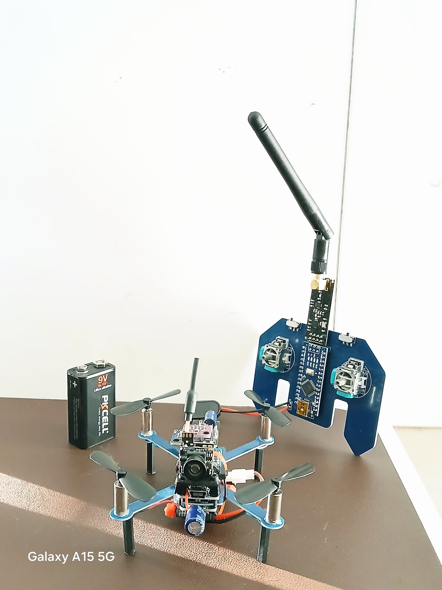

|

This prototype mostly involves components changes to the drone and the integration of an FPV camera with a AI detections. 
This prototype along with the component choices was inspired by `DroneScienceTech1993 <https://youtu.be/MMh4Zy2UXzk?si=4fPTSZabbSZ8hDzT>`_
The PCB shape and layout have been modified to fit the new electrical components of the drone. A PCB thickness was set to 1.0mm
to keep it light while maintaining a rigid frame. In terms of component changes, the microcontroller has been modified
from an Arduino Pro Mini to an Arduino Nano to support easier debugging with its built in Mini-B USB jack. 
Furthermore, this board requires an input voltage of 7-12V, so an MT3608 DC-DC boost power converter was integrated to
accomodate the new power requirements while maintaining a 3.7V battery to power the motors. A 470uF filtering capacitor was also
added at the power input to the motors to filter noise. The n-channel MOSFET at the motor driver was replaced with SI2302DS. 
A GY-BMP280-3.3 barometric pressure altitude sensor was also added to the drone and enabled inside the drone's firmware. To reduce electrical noise,
a 100uF capacitor was attached at the power terminals of the MPU6050 and BMP280 sensors. 

In terms of electrical connection changes, I followed Electronoobs setup which connects the motors to the following pin designations of the microcontroller:

* D3 => FL CW, 
* D6 => FR CCW 
* D5 => BL CCW,
* D9 => BR CW

The AUX1 and AUX2 channels are now non-inverted (1000, 2000) in the drone's firmware. The software configuration on "sensors.h" has defined the following aspects 

.. code-block::cpp
    #define QUADX
    #define MINTHROTTLE 1050
    #define MPU6050 
    #define BMP085

To lift a larger drone with additional components, a larger set of propellers at 46mm with 0.8mm shaft was used to generate a bigger thrust.

In terms of design changes to the controller, the lost of signal could be attributed to the noise generated by the copper layers surrounding
the NRF24L01 transmitter on the controller. So the controller PCB was redesigned to add a prohibited copper region around the NRF24L01 to reduce electrical noise.

**Here is a list of components used for this prototype:**
* Si2302 Mosfet n-channel (x4)
* 1N148 diode (x4)
* 0805 10KOhm resistor (x4)
* brush motors (x4)
* NRF24L01 tranmitter (x2)
* MPU6050 (x1)
* BMP280 (x1)
* 100uF cap, 470uF cap
* MMS1010 D-R slide switch (x1)
* 3.7V 30C 450mAH Battery (x1)
* MT3608 Boost converter (x1)
* Arduino Nano (x2)
* 46mm 0.8mm propellers (x4)
* MST-12D18G2 SMD Slide Switch - used for the controller (x2)
* Joysticks - used for the controller (x2)
* AMS1117-3.3 - used for the controller (x1)
* SS12SBP2 - used for the controller (x1)
* 9V battery - used for the controller (x1)
* FPV Reciever 5.8G 150CH OTG USBC (x1)
* FPV Camera Micro AIO 600TVL 3.4g 5.8GHz 25mW WT05 (x1)

The biggest feature added to this prototype was the integration of the FPV camera which involves a rust-based software implementation to interface with the drone's camera
using an FPV receiver connected either on your Windows PC or on a Raspberry Pi 5. The camera-interface application was written in Rust which picks up the frames
received from the camera which is then streamed using a gstreamer pipeline where individual frames can be pulled and run an Ultralytics detection model with embedded NMS to 
perform object detection on COCO classes.

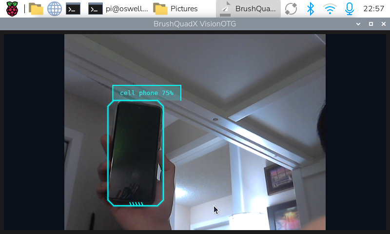

A video demonstration of the VisionOTG application was uploaded on `youtube <https://youtube.com/shorts/mpOZS6spFo8>`_. Furthermore, installers are available for download on `GitHub <https://github.com/BrushQuadX/brushquadx-visionotg/releases/tag/v1.0.1>`_
to support Windows and Raspberry Pi platforms - no extra steps are needed. 

